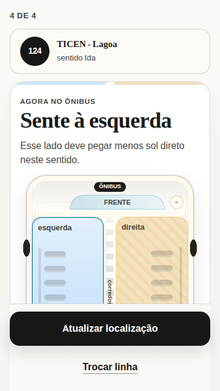
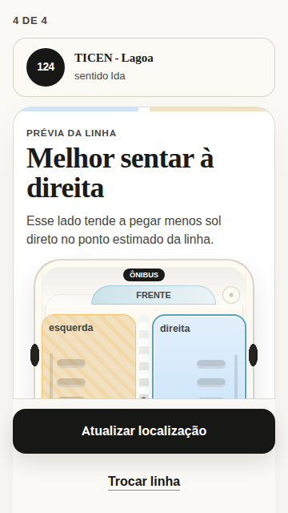
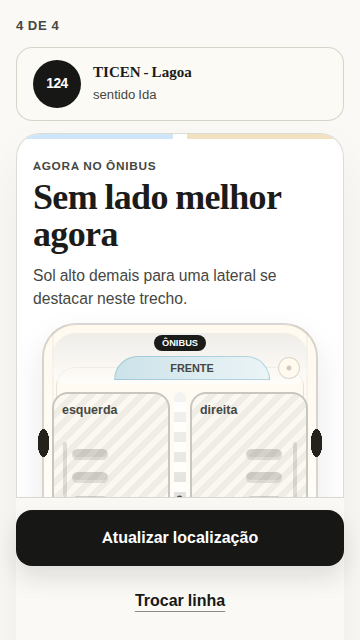
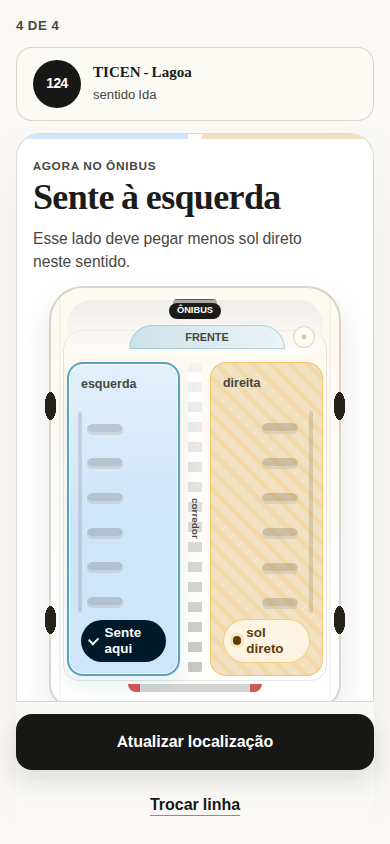
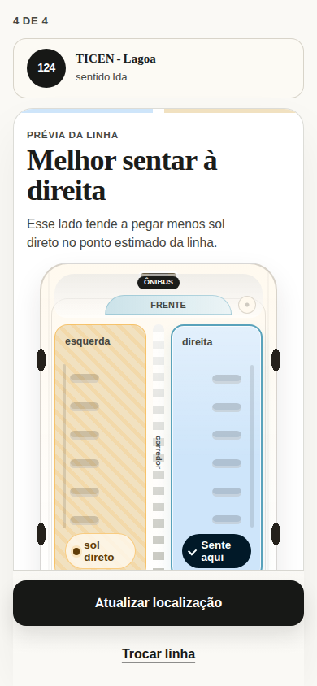
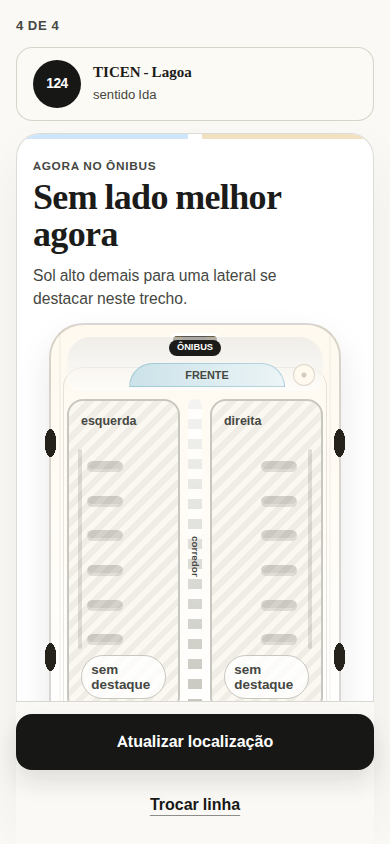

# Current Advice Result layout baseline

Captured on 2026-07-25 from the `/prototype` route with the repository's
Playwright harness. The accepted evidence uses the initial, unscrolled viewport
with animations disabled and reduced motion enabled. The development-only
Next.js control was hidden because it is not part of the product surface.

## Verdict

The current Advice Result does not meet the no-scroll destination at either
target viewport. The fixed actions remain visible, but they cover the lower
part of the Bus Orientation Diagram and the complete Geometric Estimate Notice
at the initial scroll position.

At 360 × 640 px, the current fixed action area starts at `y = 497` and consumes
143 px. With the 16 px top inset, this leaves an absolute content ceiling of
**481 px**. The representative advice surfaces are 675-731 px tall, so they
must lose **194-250 px** (29-34%) or use a different interaction pattern.

The preview state is the binding content case because its result copy and short
trust notice wrap to additional lines.

## Accepted screenshots

### 360 × 640 px

| Onboard recommendation                                                | Route preview                                                    | Neutral result                                                            |
| --------------------------------------------------------------------- | ---------------------------------------------------------------- | ------------------------------------------------------------------------- |
|  |  |  |

### 390 × 844 px

| Onboard recommendation                                                | Route preview                                                    | Neutral result                                                            |
| --------------------------------------------------------------------- | ---------------------------------------------------------------- | ------------------------------------------------------------------------- |
|  |  |  |

## Viewport budget

| Viewport  | Content starts | Fixed actions start | Fixed action height | Maximum content before actions |
| --------- | -------------: | ------------------: | ------------------: | -----------------------------: |
| 360 × 640 |          16 px |              497 px |              143 px |                     **481 px** |
| 390 × 844 |          16 px |              701 px |              143 px |                     **685 px** |

The 481 px value is the binding budget while the current two-action fixed area
remains. If the result-action contract changes, recalculate with:

```text
maximum advice content = viewport height - top inset - visible action area
```

Regardless of the action pattern, route and direction, onboard-versus-preview
status, the Seat-area Recommendation, the complete Bus Orientation Diagram, a
concise Geometric Estimate Notice, and the primary refresh action must all be
directly available at 360 × 640 px.

## Surface measurements

| State            | Viewport  | Advice content | Scroll range | Content past fixed actions | Minimum reduction |
| ---------------- | --------- | -------------: | -----------: | -------------------------: | ----------------: |
| Onboard left     | 360 × 640 |       674.9 px |       199 px |                   193.9 px |             28.7% |
| Preview right    | 360 × 640 |       731.3 px |       255 px |                   250.3 px |             34.2% |
| Neutral overhead | 360 × 640 |       712.3 px |       236 px |                   231.3 px |             32.5% |
| Onboard left     | 390 × 844 |       748.9 px |        69 px |                    63.9 px |              8.5% |
| Preview right    | 390 × 844 |       805.3 px |       125 px |                   120.3 px |             14.9% |
| Neutral overhead | 390 × 844 |       786.3 px |       106 px |                   101.3 px |             12.9% |

`Content past fixed actions` is the distance from the bottom of the Advice
Result surface to the top of the fixed action area at `scrollY = 0`. `Minimum
reduction` is that distance divided by the current Advice Result height; it is
the smallest compression that would stop the surface from intersecting the
actions, before adding any breathing room.

## Component measurements

| Component                                 |   360 × 640 |   390 × 844 | Notes                                                   |
| ----------------------------------------- | ----------: | ----------: | ------------------------------------------------------- |
| Progress label                            |       19 px |       19 px | Current `4 de 4` label                                  |
| Route metadata                            |       74 px |       74 px | Route code, route name, and direction                   |
| Result copy, onboard                      |    115.8 px |    115.8 px | Mode, title, and supporting sentence                    |
| Result copy, preview or neutral           |    153.2 px |    153.2 px | Wrapping creates the worst case                         |
| Complete diagram figure                   |      348 px |      422 px | Includes the visible figure; caption is visually hidden |
| Short estimate notice, onboard or neutral |       28 px |       28 px | Entirely below the initial action boundary              |
| Short estimate notice, preview            |     47.1 px |     47.1 px | Wraps to three lines                                    |
| Fixed actions                             |      143 px |      143 px | Primary refresh plus secondary route change             |
| Layout chrome                             | about 90 px | about 90 px | Section gaps and recommendation-panel padding           |

At 360 × 640 px, the diagram alone consumes 72% of the 481 px content budget.
Even removing all 90 px of current gaps and panel padding would leave the
required content 104-160 px over budget. A spacing-only direction therefore
cannot satisfy the destination.

## Observable baseline

- At 360 × 640 px, only 50-61% of the diagram is visible above the action area.
  The recommendation callouts, rear cue, and estimate notice are not directly
  available.
- At 390 × 844 px, onboard advice nearly exposes the complete diagram, but its
  estimate notice is still below the action boundary. Preview and neutral
  advice lose the bottom 44 px of the diagram as well as the notice.
- Route, direction, mode, recommendation, and primary action are immediately
  legible in every captured state.
- Recommendation, direct-sun, and neutral meaning use labels and patterns in
  addition to color in the captured diagrams.
- Screenshots cannot verify keyboard order, focus visibility, screen-reader
  summaries, dynamic announcements, or zoom reflow. Those remain prototype
  validation work rather than claims of this baseline task.

## Acceptance bar for visual alternatives

Every visual alternative should be checked first against the preview state at
360 × 640 px and must:

1. keep all destination-required content at or above the visible action
   boundary at the initial scroll position;
2. fit within the 481 px content ceiling if the current fixed action footprint
   is retained;
3. show the complete Bus Orientation Diagram and the short Geometric Estimate
   Notice without scrolling or action overlap; and
4. repeat the check for onboard and neutral states at both target viewports.

The unrounded capture data is available in
[`measurements.json`](measurements.json).
